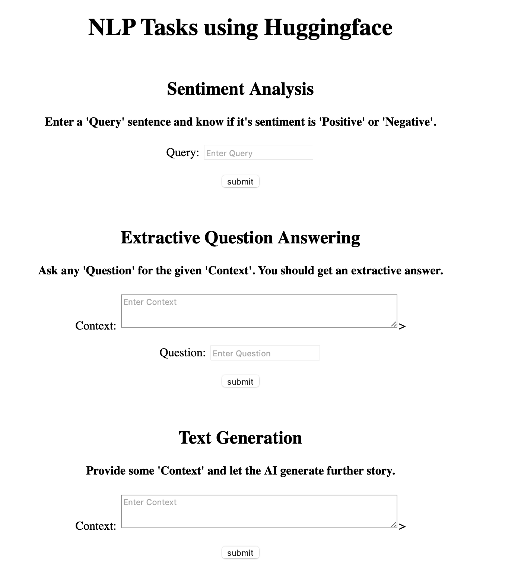

# NLP-Tasks

## Brief Description

Various NLP tasks using Huggingface and Flask. Right now, the app supports only three tasks:

1. **Sentiment Analysis**: Identify if the sentence's sentiment is _Positive_ or _Negative_.

2. **Extractive Question Answering**: For a given _Context_ paragraph ask a _Question_. You should get an _Answer_ from the paragraph.

3. **Text Generation**: Provide a _Context_ (start of a sentence) and let the AI complete your story.

Plan is to include more tasks in future. Hugginface's `transformers` library makes these things very easy to do. 

Contributions are most welcome.

## Usage

0. Clone the repo: 
    ```bash
    git clone https://github.com/ashishu007/NLP-Tasks.git
    ```

### With Docker

1. Run with docker-composer
    ```bash
    docker-compose up
    ```
### Without Docker

1. Navigate into the downloaded repo:
    ```bash
    cd NLP-Tasks/flask
    ```

2. Install the required dependencies:
    ```bash
    pip install -r requirements.txt
    ```

3. Run the flask-app:

    * Windows Powershell:
        ```bash
        $env:FLASK_APP="app.py"
        flask run
        ```

    * Linux:
        ```bash
        export FLASK_APP=app.py
        flask run
        ```

### Main Screen

<details><summary>A screenshot of main screen</summary>

 

</details>


## Contributions

1. Add more tasks
2. Improve the user-interface

## Acknowledgement

[Huggingface's transformers](https://huggingface.co/transformers/) library has revolutionised the way state-of-the-art NLP models are being used in real-world. Without, this library, the app made here would have taken tremendous amount of work (compared to what it took rn). :)

